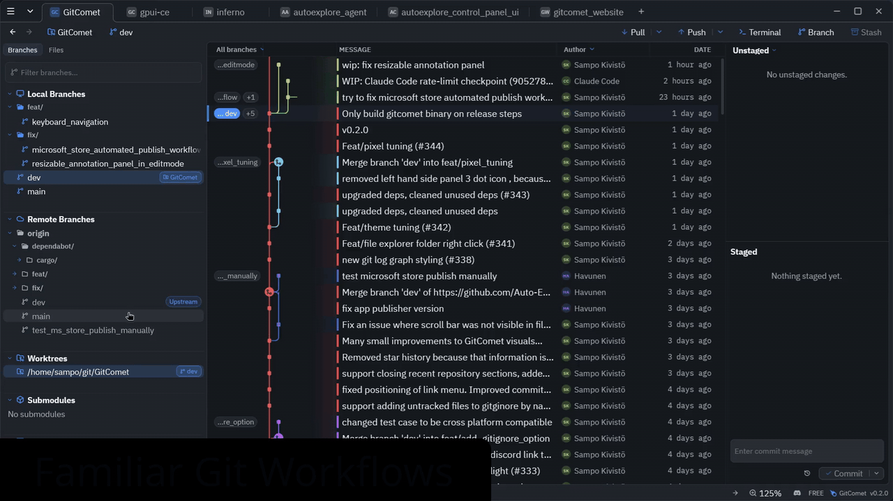

##  RepositoryTree

[](https://github.com/RepositoryTree/RepositoryTree/actions/workflows/rust.yml)
[](https://discord.gg/2ufDGP8RnA)
[](https://repositorytree.dev)
[](https://autoexplore.ai)
[](LICENSE)
[](https://github.com/RepositoryTree/RepositoryTree/releases/latest)
[](https://github.com/RepositoryTree/RepositoryTree/releases)

**Fastest Open Source Git GUI**

RepositoryTree is built for teams that want fast Git operations with local-first privacy, familiar workflows, and open source freedom.

Available for Linux, Windows, and macOS.



### Download

Download the latest prebuilt binaries/installers from [GitHub Releases](https://github.com/RepositoryTree/RepositoryTree/releases).

<details>
<summary>Windows</summary>

Download the latest Windows installer or portable binary from [GitHub Releases](https://github.com/RepositoryTree/RepositoryTree/releases).

Install from the Microsoft Store:

<a href="https://apps.microsoft.com/detail/XPFD182V1H793R?referrer=appbadge&mode=full" target="_blank"  rel="noopener noreferrer">
  
</a>

</details>

<details>
<summary>Homebrew (macOS / Linux)</summary>

App and `repositorytree` command from tap:

```bash
brew install --cask repositorytree
```

On Linux, the cask installs the AppImage build. If your system cannot launch AppImages, use the APT repo, AUR package, release tarball, or `.deb` instead.

</details>

<details>
<summary>AUR (Arch Linux)</summary>

```bash
git clone https://aur.archlinux.org/repositorytree.git
cd repositorytree && makepkg -si
```

</details>

<details>
<summary>GURU (Gentoo Linux)</summary>

```bash
emerge --ask dev-vcs/repositorytree
```

</details>

<details>
<summary>apt (Debian/Ubuntu)</summary>

```bash
curl -fsSL https://apt.repositorytree.dev/repositorytree-archive-keyring.gpg | sudo tee /usr/share/keyrings/repositorytree-archive-keyring.gpg >/dev/null
curl -fsSL https://apt.repositorytree.dev/repositorytree.sources | sudo tee /etc/apt/sources.list.d/repositorytree.sources >/dev/null
sudo apt update
sudo apt install repositorytree
```

If you install a Linux tarball or Homebrew binary on Debian, Ubuntu, or WSLg instead of the official `apt` package, install the GUI runtime libraries separately:

```bash
sudo apt install libxcb1 libxkbcommon0 libxkbcommon-x11-0
```

</details>

### Requirements

RepositoryTree requires a local Git installation of `2.50` or newer.

### RepositoryTree User Survey

We’re running this short survey to better understand how people use our Git GUI client in their daily work. Your feedback will help us improve the product and prioritize the features that matter most.

https://docs.google.com/forms/d/e/1FAIpQLSd8DKIl222UomSXrpv1q9rWodRlBSQo9pJDD62GbZEANTgD1A/viewform?usp=dialog

### Why RepositoryTree

RepositoryTree started from frustration with existing tools on huge codebases like Chromium. We could not find a product that stays responsive and functional when browsing large repositories and file diffs.

### Editions (planned)

#### Open Source

- **Price**: €0 forever
- **Usage**: Free for personal and commercial use
- **Includes**:
  - Full local-first desktop workflow
  - Git remotes, pull/push, staging, commits
  - Worktrees, branching, and full history
  - Multi-repository browsing
  - Inline and side-by-side diffs
  - 2-way and 3-way merge tools

#### Professional

- **Price**: €20 lifetime access (limited-time early adopter offer)
- **Includes everything in Open Source, plus**:
  - Claude Code, Codex, and GitHub CLI integrations
  - Code test coverage workflows
  - GitHub and Azure DevOps integrations
  - Priority improvements during early access
- Join waitlist: [repositorytree.dev/#editions](https://repositorytree.dev/#editions)

### Build from source

```bash
cargo build -p repositorytree --features ui-gpui,gix
cargo run -p repositorytree --features ui-gpui,gix -- /path/to/repo
```

### Contributing

Developer setup, workspace layout, testing, and coverage docs live in `CONTRIBUTING.md`.

### Using as a Git difftool / mergetool

RepositoryTree can be used as a standalone diff and merge tool invoked by `git difftool` and `git mergetool`. It supports both headless (algorithm-only) and GUI (interactive GPUI window) modes.

#### Setup / uninstall (recommended)

```bash
# Configure Git globally to use RepositoryTree for both difftool + mergetool
repositorytree setup

# Remove RepositoryTree integration safely
repositorytree uninstall
```

- Use `--local` to target only the current repository instead of global config.
- Use `--dry-run` to print the commands before applying changes.

This setup registers both headless and GUI variants with `guiDefault=auto`, so Git chooses GUI when display is available and falls back to headless otherwise.
`setup`/`uninstall` are designed to be idempotent.

<details>
<summary>Show detailed setup/uninstall behavior and manual commands</summary>

Built-in `setup` writes these Git config entries:

```bash
REPOSITORYTREE_BIN="/absolute/path/to/repositorytree"

# Headless tool: algorithm-only merge/diff for CI, scripts, and no-display environments
git config --global merge.tool repositorytree
git config --global mergetool.repositorytree.cmd \
  "'$REPOSITORYTREE_BIN' mergetool --base \"\$BASE\" --local \"\$LOCAL\" --remote \"\$REMOTE\" --merged \"\$MERGED\""
git config --global mergetool.trustExitCode true
git config --global mergetool.repositorytree.trustExitCode true
git config --global mergetool.prompt false

git config --global diff.tool repositorytree
git config --global difftool.repositorytree.cmd \
  "'$REPOSITORYTREE_BIN' difftool --local \"\$LOCAL\" --remote \"\$REMOTE\" --path \"\$MERGED\""
git config --global difftool.trustExitCode true
git config --global difftool.repositorytree.trustExitCode true
git config --global difftool.prompt false

# GUI tool: opens focused GPUI windows for interactive diff/merge
git config --global merge.guitool repositorytree-gui
git config --global mergetool.repositorytree-gui.cmd \
  "'$REPOSITORYTREE_BIN' mergetool --gui --base \"\$BASE\" --local \"\$LOCAL\" --remote \"\$REMOTE\" --merged \"\$MERGED\""
git config --global mergetool.repositorytree-gui.trustExitCode true

git config --global diff.guitool repositorytree-gui
git config --global difftool.repositorytree-gui.cmd \
  "'$REPOSITORYTREE_BIN' difftool --gui --local \"\$LOCAL\" --remote \"\$REMOTE\" --path \"\$MERGED\""
git config --global difftool.repositorytree-gui.trustExitCode true

# Auto-select GUI tool when DISPLAY is available, headless otherwise
git config --global mergetool.guiDefault auto
git config --global difftool.guiDefault auto
```

Built-in `setup` stores previous user values for shared generic keys under `repositorytree.backup.*` (when needed).  
Built-in `uninstall` restores those backups only when the key still has the setup-managed value. If the user changed a setting after setup, uninstall preserves that user-edited value and then removes RepositoryTree-specific keys.

</details>

#### CLI modes

**Difftool:**

```bash
repositorytree difftool --local <path> --remote <path> [--path <display_name>] [--label-left <label>] [--label-right <label>]
```

Also reads `LOCAL`/`REMOTE` from environment as a fallback when invoked by Git.

**Mergetool:**

```bash
repositorytree mergetool --local <path> --remote <path> --merged <path> [--base <path>] [--label-local <label>] [--label-remote <label>] [--label-base <label>]
```

Also reads `LOCAL`/`REMOTE`/`MERGED`/`BASE` from environment. Base is optional for add/add conflicts.

#### Compatibility

KDiff3 and Meld invocation forms are supported (`--L1/--L2/--L3`, `-o/--output/--out`, `--base`, positional arguments), so RepositoryTree can be a drop-in replacement.

### Themes

RepositoryTree supports built-in themes and user-provided custom themes.

Built-in themes are embedded in the RepositoryTree binary. Custom themes are loaded from JSON bundle files in your per-user themes directory, which RepositoryTree creates on startup.

The full theme guide, including file locations, schema details, example bundles, and override behavior, now lives in [THEMES.md](docs/themes.md).

### Crash logs

RepositoryTree writes panic logs and abnormal-exit recovery state to:

- Linux: `$XDG_STATE_HOME/repositorytree/crashes/` (fallback: `~/.local/state/repositorytree/crashes/`)
- macOS: `~/Library/Logs/repositorytree/crashes/`
- Windows: `%LOCALAPPDATA%\repositorytree\crashes\` (fallback: `%APPDATA%\repositorytree\crashes\`)

On Linux, the directory normally is `~/.local/state/repositorytree/crashes/`.
RepositoryTree creates a process-specific `session-in-progress-<pid>.log` before it
starts the GPUI runtime. A native abort, terminated UI, or GPUI event loop exit
without an explicitly requested user shutdown leaves that marker behind; Rust
panics also write `panic-*.log`. Error-level runtime diagnostics are mirrored to
`last-runtime-error-<pid>.log`, including their source location and a backtrace,
so fatal errors logged and consumed by the UI runtime remain reportable.
Recovery ignores markers owned by still-running RepositoryTree processes, so one open
instance cannot consume another's crash state.
On the next launch, RepositoryTree snapshots recovered data as
`pending-startup-report.log` and retains it until the user reports or dismisses
the notification, so a failed subsequent launch cannot discard the report before
its notification is visible.

RepositoryTree presents the report in the next UI launch and also prints its
prefilled GitHub issue URL and log path to the launching terminal. The report
includes app version, platform, structured failure details, and a trimmed
backtrace.

### Prior work and ideas inspired by:

SourceTree, GitKraken, Zed, GPUI, KDiff3, Meld, Github Desktop, Git, Gix, Rust, Smol, and many more.

This project has been created with the help of AI tools, including OpenAI Codex and Claude Code.

### License

RepositoryTree is licensed under the GNU Affero General Public License Version 3
(AGPL-3.0-only). See `LICENSE-AGPL-3.0`.

Copyright (C) 2026 AutoExplore Oy  
Contact: info@autoexplore.ai
