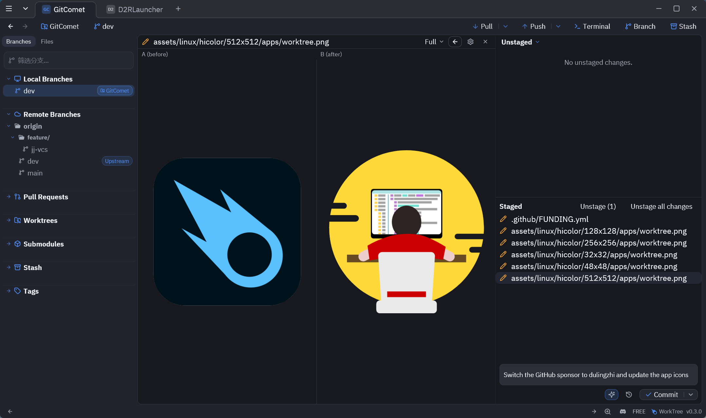

#  WorkTree

[English](README.md) | **简体中文**

[](https://github.com/dulingzhi/WorkTree/actions/workflows/rust.yml)
[](LICENSE-AGPL-3.0)
[](https://github.com/dulingzhi/WorkTree/releases/latest)
[](https://github.com/dulingzhi/WorkTree/releases)

**最快的开源 Git 图形客户端——本地优先、跨平台、Rust 打造。**

WorkTree 是一个面向 Linux、Windows 与 macOS 的免费开源 Git 图形客户端，使用 Rust 编写，界面基于 [GPUI](https://github.com/zed-industries/gpui) 渲染框架，底层通过 [gix](https://github.com/GitoxideLabs/gitoxide)（gitoxide）完成 Git 操作。它的诞生源于作者在 Chromium 规模的代码库中找不到一个足够快、足够好用的工具——因此「在超大仓库上保持流畅响应」是每个功能都必须迈过的门槛。

WorkTree 本地优先：仓库、凭证与 AI 配置都保存在你自己的机器上，只有当你执行远程操作或主动调用集成功能时，才会产生网络访问。



## 功能特性

### 完整的 Git 工作流

- 文件、hunk、单行三级暂存与丢弃
- 提交、分支、标签、远程与子模块管理
- fetch / pull / push，支持 GitLab merge request push options
- 按路径贮藏（stash），支持 keep-index、包含未跟踪文件，以及从贮藏创建分支
- 交互式 rebase 编辑器与 cherry-pick
- 基于 reflog 的操作级撤销——reset、merge、rebase、pull 均可反悔，带回滚预览
- 完整 bisect 流程，good / bad / skip 判定直接显示在历史图中
- 一等的 `git worktree` 管理
- blame 视图，工作树改动增量刷新
- 历史图支持 first-parent 模式与 ref / tag 过滤，并提供跨全历史提交搜索
- GPG 签名配置与逐提交签名徽章
- Git LFS：指针 diff、对象查看、图片 smudge 预览与 prune 清理
- 远程级 SSH key、任意提交导出 ZIP、assume-unchanged 管理器
- 历史图中的 WIP 虚拟节点，直接查看未提交改动

### Diff 与合并

- 内联与双栏 diff，支持单词级高亮
- 基于 tree-sitter 的数十种语言语法高亮
- 图片 diff、LFS 对象预览，以及 diff 视图内的内联文件编辑
- 真正的三方合并编辑器：冲突风格对齐（含 zdiff3）与自动求解

### 作为 difftool / mergetool 使用

- 一条命令 `worktree setup` 即可注册为 `git difftool` / `git mergetool`
- 有显示环境时打开交互式 GPUI 窗口，无显示环境自动回落纯算法无头模式
- 兼容 KDiff3 与 Meld 的调用形式，可直接替换

### GitHub 与 GitLab

- 侧栏拉取请求列表，附 CI 状态角标，可本地 checkout PR ref
- 通过预填 compare URL（GitHub）或 push options（GitLab）创建 PR / MR

### AI 助手——用自己的模型

- 按你最近的提交风格生成 commit message
- 对任意 hunk 一键生成自然语言解释
- 起草 MR / PR 描述，可编辑后一键复制到托管平台
- 提供方：Claude Code、Codex、GitHub Copilot（`gh` token → GitHub Models）、Gemini CLI、Ollama、通用 HTTP 端点、环境变量，或自定义命令
- 凭证本地发现、按需解析，永不落盘

### Agent 工作台

- 在 WorkTree 的内嵌终端中运行 Claude Code 或 Codex 会话
- 每个会话独占一个隔离的 git worktree，agent 不会碰你的工作树
- 「agent 改了什么」一键对比会话基线——逐路径接受改动，或从基线恢复文件

### 完善的桌面体验

- 覆盖全部操作的命令面板
- 基于 Alacritty 核心的内嵌终端
- 覆盖率 overlay：导入 lcov 格式报告（`llvm-cov` / `cargo llvm-cov` 输出），在 diff 中直接查看行的覆盖状态
- 周 / 月 / 年贡献统计与图表
- 多仓库标签页，启动时完整恢复会话
- 明暗主题，以及 JSON 格式的自定义主题包
- English 与 简体中文 界面
- 键盘优先：所有快捷键都在对应右键菜单中内联展示
- 崩溃日志与下次启动恢复，自动预填 issue 报告

### 为超大仓库而生

- 文件系统事件驱动的增量 status——只重扫变更路径，事件丢失时自动回落全量扫描
- 全链路原生性能：Rust + GPUI 渲染 + gix Git 操作 + mimalloc 分配器
- 在真实超大仓库上开发与基准测试

## 性能

WorkTree 的性能以**固定的、版本钉死的真实仓库靶子**为基准，因此下表数字可复现、可在各版本间横向对比——而非会漂移的合成档位。

**固定靶子（迭代 06）：** [rust-lang/rust](https://github.com/rust-lang/rust) @ `main`，钉死在提交 `a8a1e6fd9df2e094d6f09c0d57991508680acc1c`——**340,056 个提交**、163 个标签、磁盘占用 **1.4 GB**。快照与指标由 `scripts/generate-perf-target-manifest.sh` 生成，记录在 `benches/performance/real_repo_target.json`；发版后用该脚本即可刷新靶子。

| 场景 | 测量内容 | 实测（均值） |
| --- | --- | --- |
| `monorepo_open_and_history_load` | 打开仓库 + 加载前 1 万页历史 | 8.87 s |
| `deep_history_open_and_scroll` | 打开 + 滚动 5 万条历史 | 532 ms |
| `mid_merge_conflict_list_and_open` | 列出并打开一次中型合并的冲突 | 15.30 s |
| `large_file_diff_open` | 打开一个大文件 diff（`Cargo.lock`） | 587 ms |

数字来自 `real_repo` Criterion 基准（`cargo bench -p worktree-ui-gpui --features benchmarks --bench performance real_repo`），在钉死的快照上运行。方法学、预算框架与四腿验证基线见 `docs/superpowers/plans/2026-09-14-iteration06-performance.md`。

## 下载

从 [GitHub Releases](https://github.com/dulingzhi/WorkTree/releases) 获取最新的预编译二进制与安装包。

<details>
<summary>Windows</summary>

从 [GitHub Releases](https://github.com/dulingzhi/WorkTree/releases) 下载最新的安装程序或便携版 ZIP，或从 Microsoft Store 安装：

<a href="https://apps.microsoft.com/detail/XPFD182V1H793R?referrer=appbadge&mode=full" target="_blank"  rel="noopener noreferrer">
  
</a>

</details>

<details>
<summary>Homebrew（macOS / Linux）</summary>

```bash
brew install --cask worktree
```

Linux 上该 cask 安装的是 AppImage 版本。如果你的系统无法运行 AppImage，请改用 APT 仓库、AUR 包、发布版 tarball 或 `.deb`。

</details>

<details>
<summary>AUR（Arch Linux）</summary>

```bash
git clone https://aur.archlinux.org/worktree.git
cd worktree && makepkg -si
```

</details>

<details>
<summary>GURU（Gentoo Linux）</summary>

```bash
emerge --ask dev-vcs/worktree
```

</details>

<details>
<summary>apt（Debian / Ubuntu）</summary>

```bash
curl -fsSL https://apt.worktree.dev/worktree-archive-keyring.gpg | sudo tee /usr/share/keyrings/worktree-archive-keyring.gpg >/dev/null
curl -fsSL https://apt.worktree.dev/worktree.sources | sudo tee /etc/apt/sources.list.d/worktree.sources >/dev/null
sudo apt update
sudo apt install worktree
```

如果在 Debian、Ubuntu 或 WSLg 上使用 Linux tarball 或 Homebrew 二进制而非官方 `apt` 包，需要另行安装 GUI 运行库：

```bash
sudo apt install libxcb1 libxkbcommon0 libxkbcommon-x11-0
```

</details>

## 系统要求

WorkTree 需要本地安装 **Git 2.50 或更新版本**。

## 从源码构建

```bash
git clone https://github.com/dulingzhi/WorkTree.git
cd WorkTree
cargo build -p worktree --features ui-gpui,gix
cargo run -p worktree --features ui-gpui,gix -- /path/to/repo
```

运行与 CI 等价的测试和 lint：

```bash
cargo test --workspace --no-default-features --features gix
cargo clippy --workspace --no-default-features --features gix -- -D warnings
```

工作区结构、打包、覆盖率工具与发布流程见 [CONTRIBUTING.md](CONTRIBUTING.md)。

## 作为 Git difftool / mergetool 使用

WorkTree 可以作为独立的 diff 与 merge 工具，由 `git difftool` 和 `git mergetool` 调用，同时支持无头（纯算法）与 GUI（交互式 GPUI 窗口）两种模式。

```bash
# 一条命令把 WorkTree 注册为全局 difftool + mergetool
worktree setup

# 安全移除集成
worktree uninstall
```

- `--local` 只配置当前仓库；`--dry-run` 只打印将要执行的修改，不实际应用。
- `setup` 会同时注册无头与 GUI 两个变体，并设置 `guiDefault=auto`：有显示环境时 Git 选择 GUI，否则回落无头模式。
- 两个命令均为幂等操作。`uninstall` 会备份并恢复其可能覆盖的用户自定义配置。
- 兼容 KDiff3 与 Meld 的调用形式，可直接替换。

## 文档

- [键盘快捷键](docs/shortcuts.md)——按界面区域划分的完整快捷键参考
- [主题定制](docs/themes.md)——文件位置、schema 与示例主题包
- [参与贡献](CONTRIBUTING.md)——工作区结构、构建、测试、覆盖率与发布打包

## 崩溃日志

WorkTree 将 panic 日志与异常退出恢复状态写入：

- Linux：`$XDG_STATE_HOME/worktree/crashes/`（默认 `~/.local/state/worktree/crashes/`）
- macOS：`~/Library/Logs/worktree/crashes/`
- Windows：`%LOCALAPPDATA%\worktree\crashes\`（回落 `%APPDATA%\worktree\crashes\`）

下次启动时，WorkTree 会展示恢复的报告——应用版本、平台、结构化失败详情与裁剪后的回溯——并在启动终端打印预填好的 GitHub issue 链接与日志路径，由你决定上报或忽略。

## 社区

- [Discord](https://discord.gg/2ufDGP8RnA)——提问、反馈、跟进开发进展
- [worktree.dev](https://worktree.dev)——官方网站

## 致谢

WorkTree 的设计与实现受到以下项目的启发：SourceTree、GitKraken、Zed、GPUI、KDiff3、Meld、GitHub Desktop、Git、Gix、Rust、Smol 等。

本项目在 AI 工具（包括 OpenAI Codex 与 Claude Code）的协助下创建。

## 许可证

WorkTree 以 GNU Affero General Public License v3.0（AGPL-3.0-only）授权，见 [LICENSE-AGPL-3.0](LICENSE-AGPL-3.0)。

Copyright (C) 2026 AutoExplore Oy
Contact: info@autoexplore.ai
